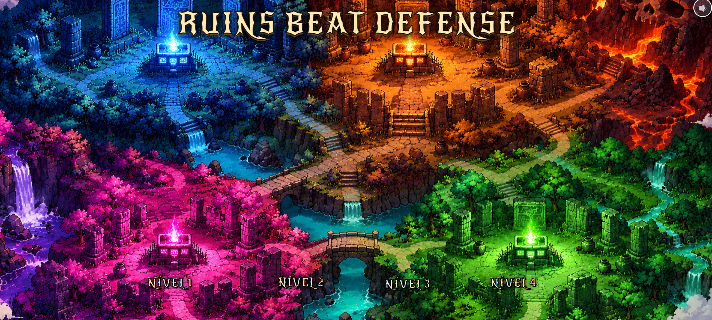
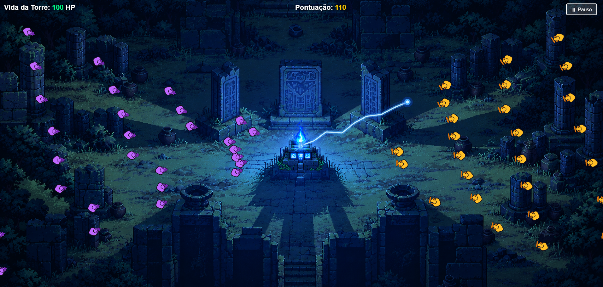
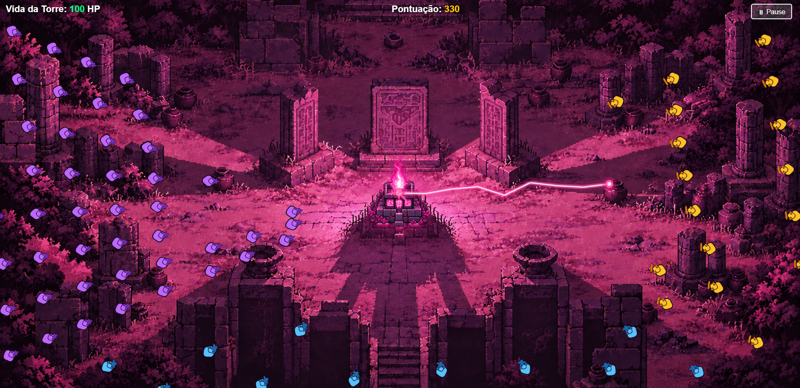

# utf-cg-tp1
Trabalho Prático 1 - Tower Defense

**O jogo:**
    **Ruins Beat Defense** é um jogo 2D no estilo Tower Defense, baseado no ritmo musical, no qual o jogador deve proteger uma torre central contra ondas de inimigos até que a música da fase termine.

    No centro do cenário encontra-se uma torre representada por um altar localizado em meio às ruínas. O jogador deve defendê-lo dos ataques dos inimigos, utilizando suas próprias ações para impedir que a estrutura seja destruída.

    O jogo possui quatro fases, e cada uma apresenta uma música, um cenário e desafios próprios. As primeiras fases possuem ritmos e padrões de ataque mais simples, enquanto as fases seguintes aumentam gradualmente a dificuldade, acompanhando o ritmo e a intensidade das músicas.

    Além disso, cada tipo de inimigo está associado a um instrumento presente na música da respectiva fase. Os inimigos surgem no cenário de acordo com a execução de seus instrumentos, fazendo com que o ritmo e os diferentes elementos musicais da música determinem diretamente o surgimento e a dinâmica dos ataques. Dessa forma, a música não funciona apenas como trilha sonora, mas também como parte fundamental da mecânica de jogo.

    O objetivo de cada fase é sobreviver até o final da música. Caso o altar seja destruído antes que a música termine, o jogador perde a fase. Se conseguir protegê-lo até o final da música, a fase é concluída.

    Diferentemente de jogos que utilizam uma progressão linear, **Ruins Beat Defense** não exige que o jogador conclua as fases anteriores para acessar as seguintes. As quatro fases ficam disponíveis para que o jogador possa escolher livremente a ordem em que deseja enfrentá-las e explorar os diferentes desafios e ritmos oferecidos pelo jogo.

**Criadores:**
    João Pedro Oliveira Guimarães 
    Kamilla Silveira da Silva

**Opcionais:**
    1. Texturas animadas: você pode criar animações de personagens ou cenário. Por exemplo, para inimigo andando, atacando... uma explosão, para os projéteis etc
    2. Telas: faça um jogo completo, ou seja, implemente telas de splash screen, menu inicial, créditos, opções, game over, etc
    3. Sons: Colocar efeitos sonoros e música de fundo no seu jogo
    4. Tela cheia: faça com que seja possível colocar em tela cheia e que a razão de aspecto do jogo seja sempre mantida, independente das dimensões da janela (windowed ou full screen), mas que o jogo ocupe a maior área possível da janela e ficando centralizado
    5. Inimigos diferentes: faça inimigos visual e mecanicamente diferentes, como com velocidades distintas, frequência de ataque, dano etc
    6. Inimigos em ondas: crie o conceito de ondas de inimigos (fases) para que o jogador possa conciliar momentos de maior tensão ou maior relaxamento (no intervalinho entre ondas). As ondas podem ser "fases curadas" e finitas, ou infinitas (com aumento de dificuldade)

**Créditos:**
    Músicas: 
        - Nível 1:  https://www.youtube.com/watch?v=oHZDWwW6iXs&list=PLKXdyINOQYsb38jn5HGiF6w8X3rph4IIx&index=5
        - Nível 2:  https://www.youtube.com/watch?v=5qZqqUgb1Rw&list=PLKXdyINOQYsb38jn5HGiF6w8X3rph4IIx&index=59
        - Nível 3:  https://www.youtube.com/watch?v=mNWArmA5wMw&list=PLKXdyINOQYsb38jn5HGiF6w8X3rph4IIx&index=14
        - Nível 4:  https://www.youtube.com/watch?v=KK3KXAECte4&list=PLKXdyINOQYsb38jn5HGiF6w8X3rph4IIx&index=100
        - Menu: https://www.youtube.com/watch?v=3t-6qAQH_bQ&list=PLKXdyINOQYsb38jn5HGiF6w8X3rph4IIx&index=4